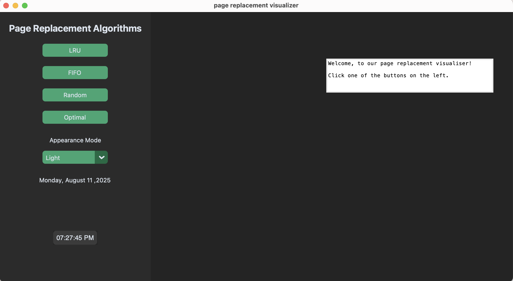
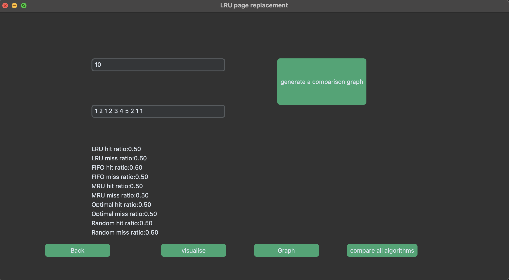
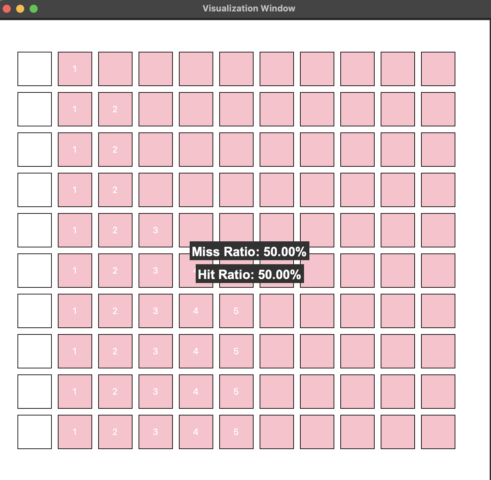

# Page Replacement Algorithm Visualizer (Python + Tkinter)

A **Python Tkinter-based** visual tool to explore and understand **Page Replacement Algorithms**.  
This interactive application displays **real-time graphs** of hit and miss ratios, helping you visualize how different algorithms perform.

## ✨ Features
- **Real-time graph plotting** (using Matplotlib) for:
  - Hit Ratio
  - Miss Ratio
- **Multiple algorithms supported** (FIFO, LRU, Optimal, etc.)
- **Customizable frame size** — experiment with different memory constraints
- **Interactive GUI** built with `Tkinter` and `CustomTkinter`
- Educational tool for OS students and enthusiasts

## Preview (a few sample screenshots of the app)
### Homepage

### LRU Algorithm

### Visualization Window


## Getting Started
### 1. Clone the repository
```bash
git clone https://github.com/<your-username>/Page-Replacement-Algorithm-Visualizer-with-Python-Tkinter.git
cd Page-Replacement-Algorithm-Visualizer-with-Python-Tkinter
```

### 2. Next, run the main file, PRAC.py on your editor after installing customtkinter, tkinter and matplotlib modules.
